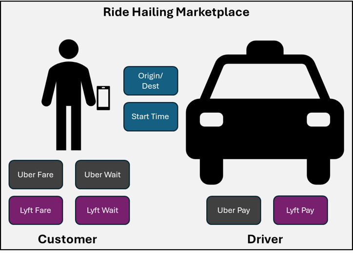
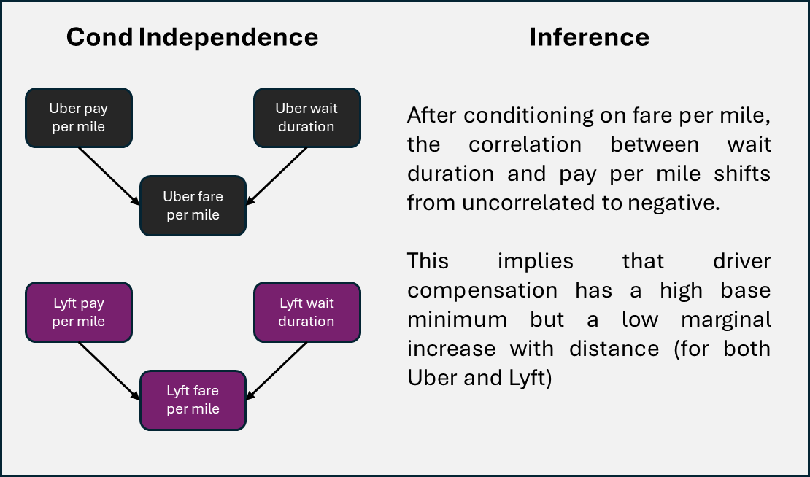
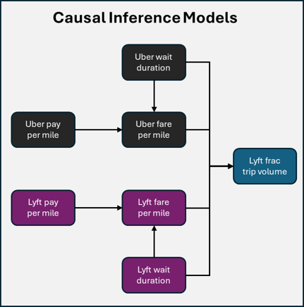
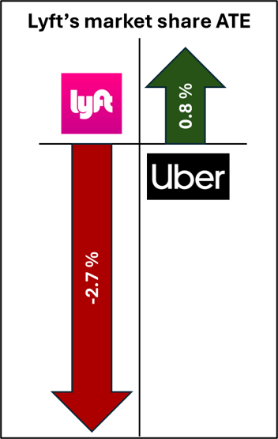
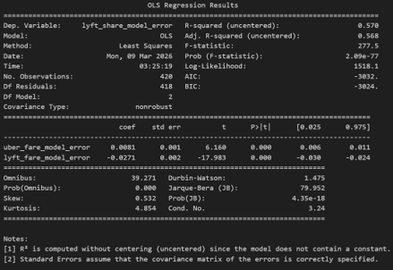
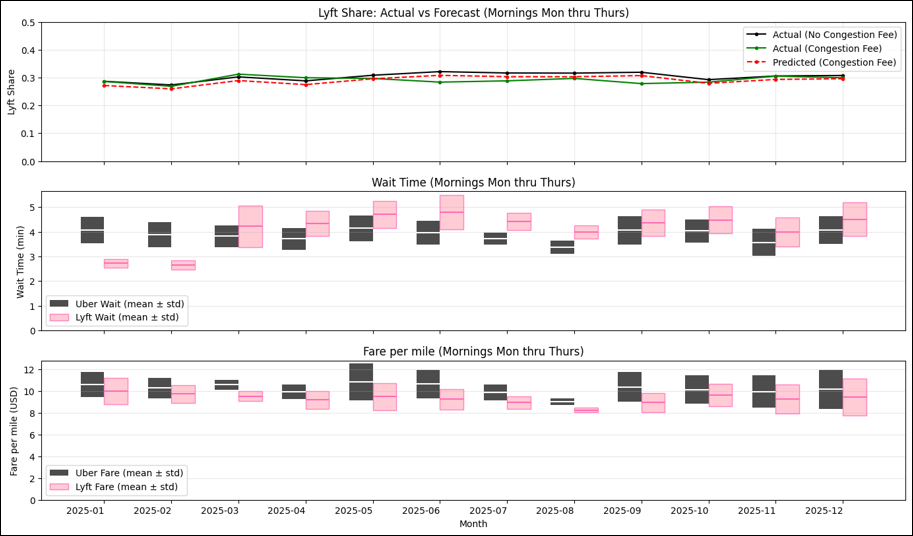

# 🚕 Uber vs Lyft Market Share in NYC

## 📊 Executive Summary

This project estimates the change in market share of Uber and Lyft because of the congestion fee introduced in NYC. This project uses double machine learning to estimate the ATE of increasing the fare per mile for both Uber and Lyft on the eventual market share. The finding suggests that Lyft loses three times the market share that Uber loses for every increase in fare per mile on average. Data will be made available upon request

## 🎯 Introduction and Scope

### Data Source
- **Dataset**: NYC TLC (Taxi and Limousine Commission) taxi trip records
- **Period**: 2 years of operational data
- **Focus**: Comparative analysis of Uber and Lyft performance metrics

### Study Parameters
The analysis was restricted to ensure data quality and relevance:

#### ⏰ Time Windows
- **Morning Peak Hours**: 6:00 AM - 10:00 AM
- **Evening Peak Hours**: 4:00 PM - 8:00 PM

#### 📅 Days
- Monday through Thursday (focusing on pre-workday and post-workday travel patterns)

#### 🗺️ Route Selection
- Only routes with service from both platforms (minimum ten trips per provider)
- Data aggregated to the route and morning/evening times of the date

## 🔬 Methodology

### Marketplace Decision Factors
The analysis considers both supply-side (driver) and demand-side (customer) factors that influence market dynamics in the ride-sharing ecosystem.

### Key Performance Indicators

The following metrics were defined and calculated (grouped by origin, destination, and time-period):

| Metric | Description | Unit |
|--------|-------------|------|
| **Customer Fare per Mile** | Average price paid by customers per mile traveled | $/mile |
| **Driver Pay per Mile** | Average compensation received by drivers per mile | $/mile |
| **Wait Duration** | Average customer wait time for ride availability | minutes |
| **Lyft Fractional Share** | Percentage of total trips completed on Lyft platform | % |

### Causal Discovery

For both Uber and Lyft, the causal inference links between fare per mile, pay per mile and wait duration are identified using conditional independence testing.

Both wait durations and fare per miles are causally linked to the lyft share since all four factors are visible to the end customer

`

### Causal Inference (DML) using cross validation

#### Nuisance Functions

Uber wait duration and Lyft wait duration are used to predict the Uber fare, Lyft fare and Lyft share

XGBoost models are used after hyperparameter tuning for each nuisance model

#### Linear Regression Model

The errors from each fare model are used to build a linear regression model predicting the error in the Lyft share

Uber Fare (ATE) on Lyft's market share :  0.8\%
Lyft Fare (ATE) on Lyft's market share : -2.7\%

Uber and Lyft ATE Orthogonal Regression Summary (Aggregated on days)

### Causal Inference to predict the Lyft market share change because of congestion fee

The congestion fee adds to the customer fare. To incorporate it into the model, the congestion fee per mile is calculated and added to the fare per mile

#### Training model

The nuisance functions and regression model are trained on the 2024 data

#### Market share difference (2025)

Market share is calculated for the 2025 routes which do not have the congestion fee. The market share for congestion fee routes in 2025 is calculated using the ATE calculated in the previous step and the average congestion fee per mile (for both Uber and Lyft).

#### Goodness of fit

The calculated congestion fee routes market share is compared to the actual congestion fee routes market share

